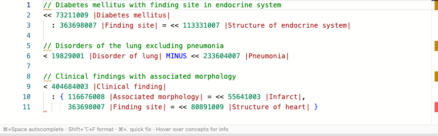
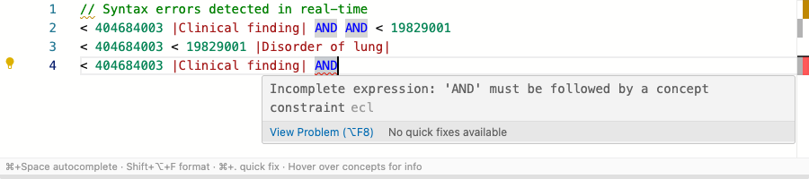
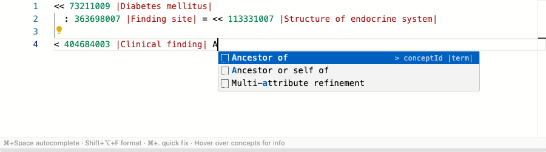
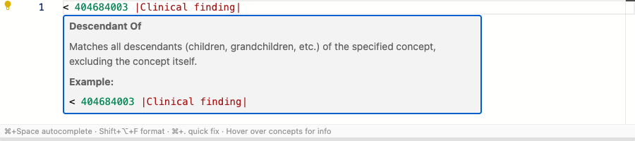
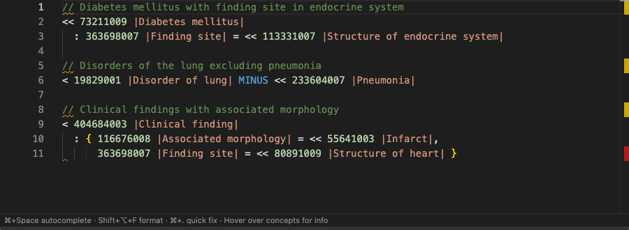

<p align="center">
  
</p>

# ECL Language Tools

[](https://github.com/aehrc/ecl-lsp/actions/workflows/ci.yml)
[](https://github.com/aehrc/ecl-lsp/actions/workflows/ci.yml)
[](https://confluence.ihtsdotools.org/display/DOCECL)
[](https://nodejs.org/)
[](LICENSE)

IDE support for **SNOMED CT Expression Constraint Language (ECL) 2.2** — parsing, validation, completion, formatting, refactoring, and terminology integration across 7 editors, the browser, and Slack.

## Screenshots

| Syntax Highlighting                                         | Error Diagnostics                                       |
| ----------------------------------------------------------- | ------------------------------------------------------- |
|  |  |

| Autocompletion                                    | Hover Information                                |
| ------------------------------------------------- | ------------------------------------------------ |
|  |  |

| Dark Theme                                |
| ----------------------------------------- |
|  |

## What is ECL?

Expression Constraint Language (ECL) is the standard query language for [SNOMED CT](https://www.snomed.org/), the world's most comprehensive clinical terminology. ECL expressions define sets of clinical concepts — for use in value sets, clinical decision support, analytics, and data validation. See the [ECL Specification](https://confluence.ihtsdotools.org/display/DOCECL).

## Packages

| Package                                               | Description                                                                                                   | Install                                |
| ----------------------------------------------------- | ------------------------------------------------------------------------------------------------------------- | -------------------------------------- |
| [@aehrc/ecl-core](packages/ecl-core/)                 | Zero-dependency core library (parser, formatter, validation, completion, refactoring, terminology, knowledge) | `npm install @aehrc/ecl-core`          |
| [@aehrc/ecl-lsp-server](packages/ecl-lsp-server/)     | LSP server for IDE integration                                                                                | `npm install -g @aehrc/ecl-lsp-server` |
| [@aehrc/ecl-editor-core](packages/ecl-editor-core/)   | Headless Monaco Editor integration                                                                            | `npm install @aehrc/ecl-editor-core`   |
| [@aehrc/ecl-editor-react](packages/ecl-editor-react/) | React component                                                                                               | `npm install @aehrc/ecl-editor-react`  |
| [@aehrc/ecl-editor](packages/ecl-editor/)             | Web Component (`<ecl-editor>`)                                                                                | `npm install @aehrc/ecl-editor`        |
| [@aehrc/ecl-slack-bot](packages/ecl-slack-bot/)       | Slack bot for validating, formatting, and evaluating ECL expressions                                          | [Docker](packages/ecl-slack-bot/)      |

## IDE Clients

| Editor        | Type                   | Link                                        |
| ------------- | ---------------------- | ------------------------------------------- |
| VSCode        | Extension (VSIX)       | [clients/vscode](clients/vscode/)           |
| IntelliJ IDEA | Plugin (Kotlin/Gradle) | [clients/intellij](clients/intellij/)       |
| Eclipse       | Plugin (LSP4E/TM4E)    | [clients/eclipse](clients/eclipse/)         |
| Neovim        | LSP config             | [clients/neovim](clients/neovim/)           |
| Sublime Text  | LSP config             | [clients/sublime](clients/sublime/)         |
| Emacs         | eglot/lsp-mode config  | [clients/emacs](clients/emacs/)             |
| Claude Code   | Plugin                 | [clients/claude-code](clients/claude-code/) |

## Features

| Feature               | Description                                                                                                    |
| --------------------- | -------------------------------------------------------------------------------------------------------------- |
| **Diagnostics**       | Syntax errors, inactive/unknown concept warnings, semantic validation                                          |
| **Completion**        | Context-aware operators, keywords, filter values, SNOMED CT concept search, 18 snippets                        |
| **Hover**             | Operator documentation, concept information (FSN, PT, active status)                                           |
| **Formatting**        | Document and range formatting with 9 configurable options                                                      |
| **Code Actions**      | 8 refactoring actions (strip/add display terms, simplify, parentheses, history supplement, description filter) |
| **Code Lens**         | "Evaluate" lens with inline concept count                                                                      |
| **Semantic Tokens**   | Token-level highlighting                                                                                       |
| **SNOMED CT Edition** | Status bar selector for edition/version switching                                                              |
| **FHIR Integration**  | Concept lookup, ECL evaluation, concept search via FHIR terminology server                                     |

Full ECL 2.2 coverage: constraint operators, logical operators, refinements, dotted expressions, member of, concrete values, filters, history supplements, nested expressions, and comments.

## Quick Start

```bash
git clone https://github.com/aehrc/ecl-lsp.git && cd ecl-lsp
npm install          # Installs all workspace dependencies
npm run compile      # Compiles all packages
npm test             # Runs 1653+ tests
```

Then open the project in VSCode and press **F5** to launch with the ECL extension, or install `@aehrc/ecl-lsp-server` globally and configure your preferred editor (see [IDE Clients](#ide-clients)).

## Project Structure

```
ecl-lsp/
├── grammar/                  ANTLR4 ECL grammar (official IHTSDO)
├── shared/syntaxes/          TextMate grammar (shared across clients)
├── packages/
│   ├── ecl-core/             Core library (parser, formatter, completion, refactoring, semantic, terminology, knowledge)
│   ├── ecl-lsp-server/       LSP server
│   ├── ecl-editor-core/      Monaco Editor integration
│   ├── ecl-editor-react/     React component
│   ├── ecl-editor/           Web Component
│   └── ecl-slack-bot/        Slack bot
├── clients/
│   ├── vscode/               VSCode extension
│   ├── intellij/             IntelliJ IDEA plugin
│   ├── eclipse/              Eclipse IDE plugin
│   ├── claude-code/          Claude Code plugin
│   ├── neovim/               Neovim config guide
│   ├── sublime/              Sublime Text config guide
│   └── emacs/                Emacs config guide
└── examples/                 Example ECL files
```

## Configuration

All LSP settings are under the `ecl.*` namespace. See the [@aehrc/ecl-lsp-server README](packages/ecl-lsp-server/) for the full configuration reference.

## Contributing

See [CONTRIBUTING.md](CONTRIBUTING.md) for setup, testing, and development workflow.

## Security

See [SECURITY.md](SECURITY.md) for reporting vulnerabilities.

## Resources

- [SNOMED CT ECL Specification](https://confluence.ihtsdotools.org/display/DOCECL)
- [ECL Grammar (IHTSDO)](https://github.com/IHTSDO/snomed-expression-constraint-language)
- [Language Server Protocol](https://microsoft.github.io/language-server-protocol/)
- [FHIR Terminology Services](https://hl7.org/fhir/terminology-service.html)

## License

Copyright 2026 Commonwealth Scientific and Industrial Research Organisation (CSIRO) ABN 41 687 119 230

Licensed under the Apache License, Version 2.0 — see [LICENSE](LICENSE).
